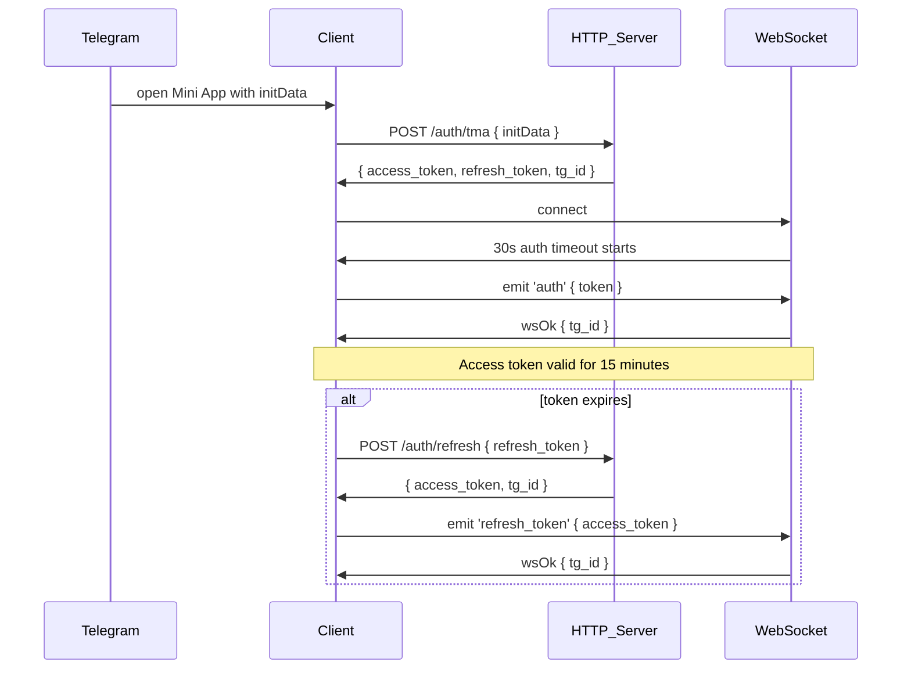

#  Авторизация в приложении

## Шаги
1. Пользователь запускает игру → клиент получает `initData`.
2. Клиент отправляет `POST /auth/tma` с `initData`.
3. Сервер возвращает: `access_token`, `refresh_token`, `tg_id`.
4. Клиент подключается к WebSocket (`/ws`).
5. В течение 30 секунд после подключения клиент обязан отправить событие `auth` с `access_token`.
6. При истечении access token:
   - Отправляет `POST /auth/refresh` с `refresh_token`
   - Получает новый `access_token`
   - Вызывает `emit('refresh_token', { token })`

## Ответы WebSocket

```ts
{
  status: 'ok' | 'error',
  payload?: any,
  error?: { code: string, message: string }
}
```


