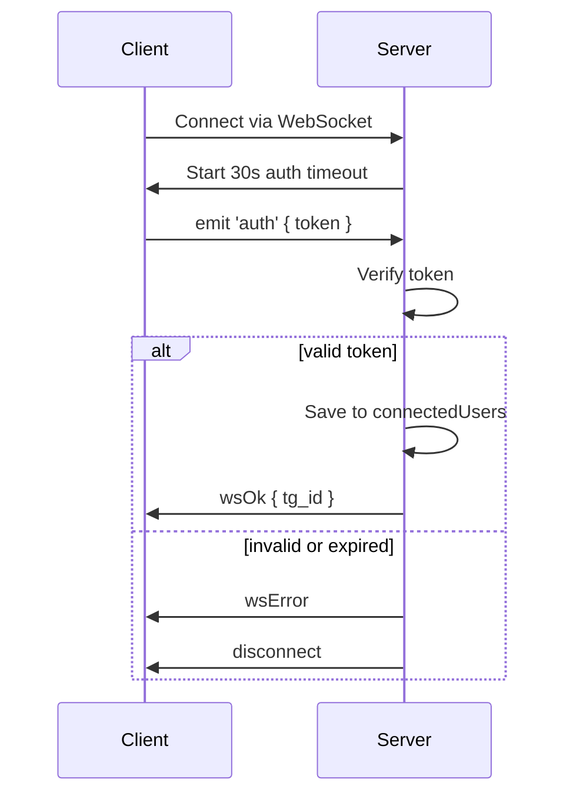
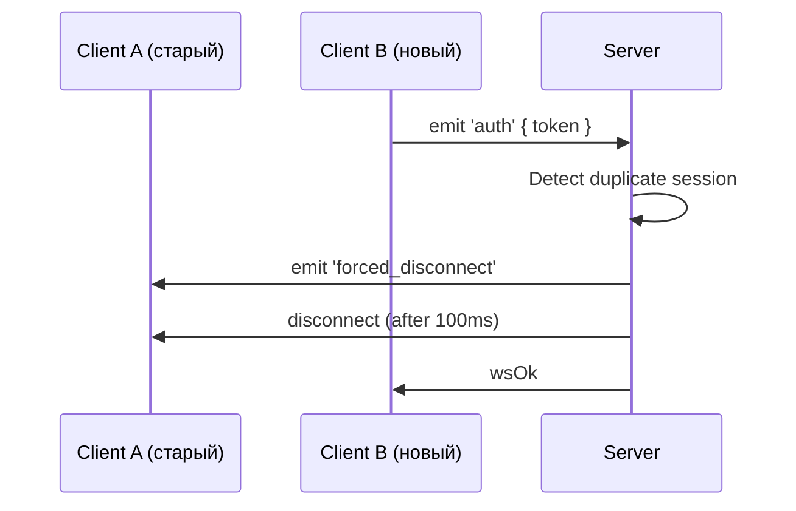
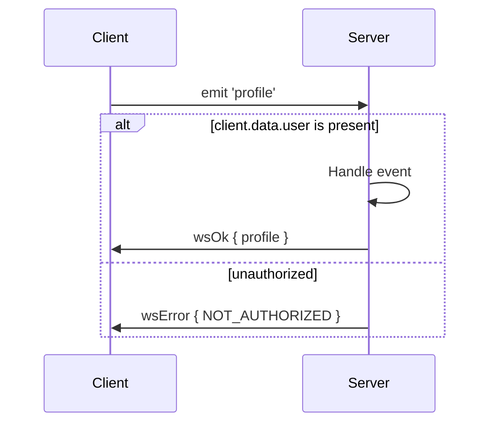

# 📡 WebSocket Авторизация: Архитектура и Поведение

Документация по архитектуре WebSocket-авторизации и управления сессиями в проекте.

---

## 🔐 Авторизация (`auth`)

- Клиент подключается к серверу через WebSocket.
- В течение **30 секунд** клиент должен отправить событие `auth` с JWT токеном.
- Если токен валиден, пользователь считается авторизованным.
- При повторной авторизации:
  - предыдущая сессия отключается (`forced_disconnect`);
  - новая замещает её.

---

## ♻️ Обновление токена (`refresh_token`)

- Доступно **только для авторизованных** клиентов.
- Повторный вызов с тем же токеном не вызывает побочных эффектов (идемпотентно).
- Попытка вызвать `refresh_token` без `auth` — запрещена (`NOT_AUTHORIZED`).

---

## 🧾 Защищённые события

- Если авторизация отсутствует — возвращается `NOT_AUTHORIZED`.

---

## ❌ Замена сессии (`forced_disconnect`)

- При подключении нового клиента с тем же `tg_id`, старая сессия:
  - получает событие `forced_disconnect` с кодом `TOKEN_REPLACED`;
  - отключается через 100 мс.
- Это предотвращает мультисессию под одним аккаунтом.

---

## ⏳ AuthTimeoutService

- После подключения запускается таймер авторизации на **30 секунд**.
- Если пользователь не отправил `auth` — соединение закрывается.
- Таймер сбрасывается при успешной авторизации или `disconnect`.

---

## 📊 Статистика (`room_stats`)

- Каждые 60 секунд сервер отправляет количество авторизованных пользователей.
- Формат события: `room_stats` → `{ status: 'ok', payload: { total_lobbies: number } }`.

---

## 📦 Формат всех ответов (WsResponse)

```ts
interface WsResponse<T> {
  status: 'ok' | 'error';
  payload?: T;
  error?: {
    code: string;
    message: string;
  };
}
```

---

## 📈 Диаграммы (Mermaid)

### Авторизация



---

### Повторное подключение (forced_disconnect)



---

### Защищённое событие


